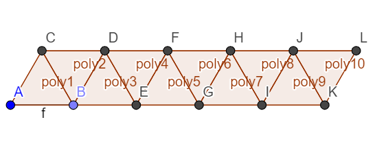
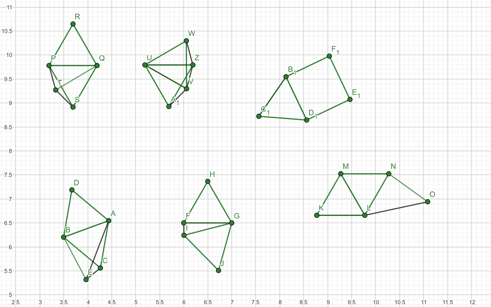

# Пары на единичном расстоянии

## Постановка задачи

Пусть S - множество вершин строго выпуклого n-угольника в R2. \
Пусть u(S) - число пар вершин p, q на единичном расстоянии друг от друга. \
Доказать или опровергнуть, что u(S) = O(n).

## Ссылки

https://arxiv.org/pdf/cs/9808008.pdf - исходная постановка задачи\
H. Edelsbrunner and P. Hajnal, A lower bound on the number of unit distances
between the vertices of a convex polygon, J. Combin. Theory Ser. A 56 (1991),
312–316. - нижняя граница, нужно ознакомиться\
Z. F¨uredi, The maximum number of unit distances in a convex n-gon, J. Combin.
Theory Ser. A 55 (1990), 316–320 - верхняя граница, нужно ознакомиться

## Выясненное

### Для нестрого выпуклого
Достигнутая нижняя оценка - 2n-3\

### Для малых размерностей
В 5-угольнике максимальное количество = 2n-4 = 6\

### Прочее
[geogebra](https://www.geogebra.org) - удобная тула для моделирования многоугольников
